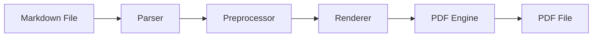

# Complex Mixed Document

This document combines all element types to test the full pipeline.

## Architecture Overview



## API Endpoints

| Method | Endpoint | Description | Auth | Rate Limit |
|--------|----------|-------------|------|------------|
| POST | `/api/convert` | Convert MD to PDF | Optional | 10/min |
| GET | `/api/styles` | List themes | None | 100/min |
| GET | `/api/health` | Health check | None | No limit |

## Configuration Example

```yaml
output:
  directory: ./pdfs
  create_if_missing: true
  overwrite: true

style:
  theme: github
  toc: true
  toc_level: 3
```

## Implementation Notes

The converter follows a **pipeline architecture** where each stage transforms
the document incrementally:

1. **Parser**: Converts raw Markdown to an AST using `markdown-it-py`
2. **Preprocessor**: Handles Mermaid diagrams, analyzes tables, resolves images
3. **Renderer**: Generates HTML with CSS styling and syntax highlighting
4. **PDF Engine**: Converts HTML to PDF using WeasyPrint with CSS Paged Media

> **Note**: The pipeline is designed so each stage can be tested independently.
> This is a core architectural principle per the project constitution.

### Performance Characteristics

| Stage | Typical Duration | Memory Usage | Bottleneck |
|-------|-----------------|--------------|------------|
| Parse | < 100ms | Low | N/A |
| Preprocess | 1-5s (Mermaid) | Medium | mmdc subprocess |
| Render | < 200ms | Low | N/A |
| PDF Gen | 2-10s | High | WeasyPrint layout |

### Code Example

```python
from mdpdf.converter import Converter
from mdpdf.config import ConversionConfig

config = ConversionConfig()
converter = Converter(config)
result = converter.convert("README.md")

if result.success:
    print(f"Generated {result.pages} pages: {result.output_path}")
else:
    print(f"Error: {result.error}")
```

## Conclusion

This fixture validates that all element types coexist correctly in a single
document without layout conflicts or rendering issues.
