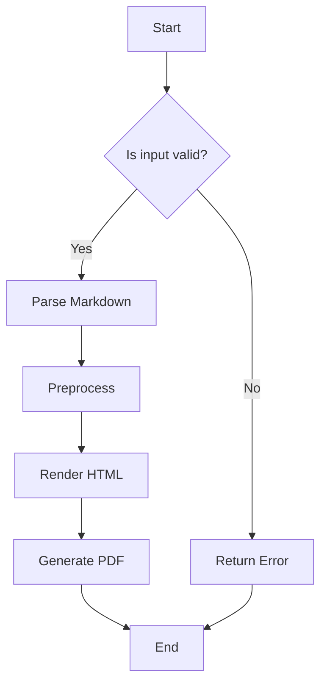
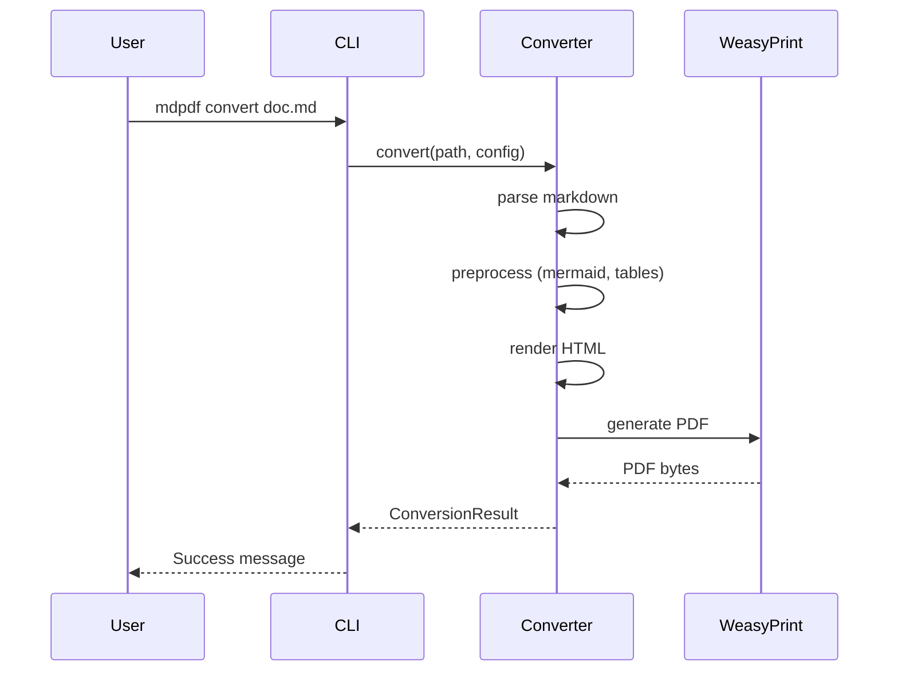
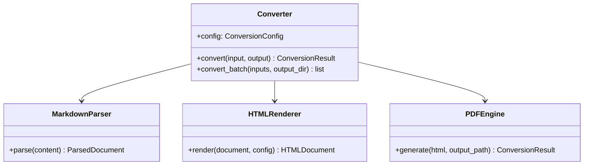

# Mermaid Diagrams Test Document

## Flowchart



## Sequence Diagram



## Class Diagram



## Invalid Diagram (should show error)

```mermaid
flowchart TD
    A[Start --> B{Missing bracket
    B --> C[End
    this is invalid syntax!!!
```
